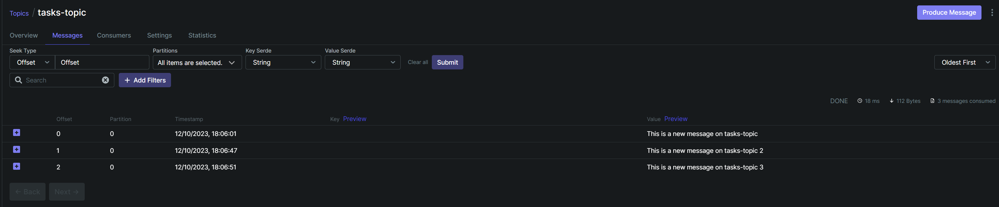
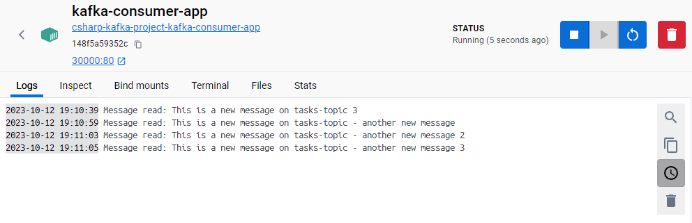

# Kafka Simple Example

This is a sample project created for demonstration and learning purposes. It serves as a case in point to illustrate concepts and showcase functionalities in a development environment. The project includes a range of typical components and configurations that can be helpful as a starting point or reference.

## Running the producer app

```
    docker compose up kafka-producer-app --build -d
```
## Urls

> Producer: http://localhost:30001

> Consumer http://localhost:30000

> Kafka UI: http://localhost:8080

## Registering a message with the producer

When the kafka-producer-app is up and running execute the **register_message.http** file to add a message to the topic desired.
The topic will be automatic created if it does not exist.


## View the data on the kafka ui




## Execute the consumer and watch the message be processed

```
    docker compose up kafka-consumer-app --build -d
```

